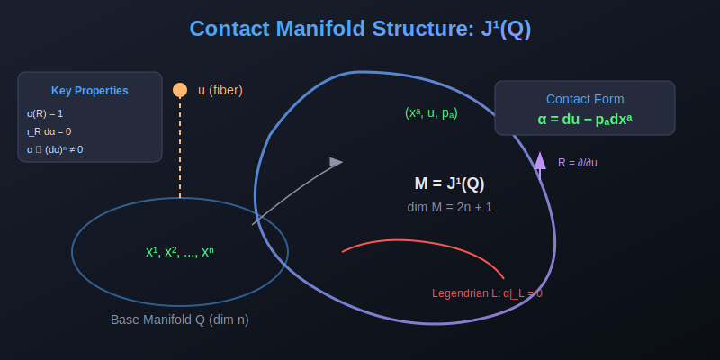

# Contact Thermodynamics

[](https://opensource.org/licenses/MIT)
[](https://nodejs.org/)
[](#testing)

A JavaScript implementation of **Contact Geometry for Extended Thermodynamics** based on 1-jet bundles, now enhanced with **Geometric Algebra**, **Discrete Geometric Calculus**, and **FTGC on Triangle Meshes**.

<p align="center">
  
</p>

## 🌟 Features

- **Contact Manifolds**: Full implementation of 1-jet bundles J¹(Q) with canonical contact form
- **Geometric Algebra**:
  - **Multivectors**: Proper handling of Cl(p,q,r) algebras, geometric products, and rotors
  - **Bivector Classification**: Elliptic (rotation), Parabolic (translation), Hyperbolic (boost)
  - **Discrete Calculus**: Split differential operator ∇, gradient, divergence, curl
- **Riemannian Geometry via GA**:
  - **Connection Bivectors**: Replace Christoffel symbols with ωᵢ = ½ eʲ ∧ (∂ᵢeⱼ)
  - **Curvature 2-Form**: Cartan structure equation Ω = dω + ω ∧ ω
  - **Coordinate-Free Geodesics**: Solve ∇ᵥv = 0 without index gymnastics
  - **Parallel Transport & Holonomy**: Transport vectors around loops
  - **Gauss-Bonnet Integration**: Verify ∫∫K dA = 2πχ(M)
  - **Manifolds**: Sphere, Torus, Hyperbolic Plane with verified curvature
- **Spacetime Geometric Algebra** (NEW):
  - **Spacetime Algebra**: Direct Cl(1,3) implementation for General Relativity
  - **Tetrad Formalism**: Automatic $e_a^\mu$ extraction from metrics
  - **Spacetime Connection**: Spin connection bivector $\omega_\mu$ without Christoffel symbols
  - **Entropic Force**: $S \approx |\omega|^2$ curvature potential driving motion
- **Discrete Riemannian Geometry** (NEW):
  - **Mesh Connection Bivector**: Dihedral rotation at edges
  - **Angle Defect Curvature**: K = 2π - Σθ at vertices
  - **Discrete Parallel Transport**: Transport across mesh edges
  - **Bianchi Identity**: Verified via Gauss-Bonnet Σ Kᵥ = 2πχ(M)
- **FTGC on Triangle Meshes**:
  - **Triangle Mesh**: Typed arrays, auto-topology, boundary detection
  - **Cotan Laplacian**: Mixed Voronoi dual areas, cotan weights
  - **Geometric Derivative**: Unified ∇ = ∇· + ∇∧ on staggered mesh storage
  - **PDE Solvers**: Wave/heat/Maxwell with Dirichlet boundary conditions
- **Three Model Scales**:
  - **Grand Model (M₁₃)**: 13-dimensional full phase space
  - **Holographic Model (M₇)**: 7-dimensional with emergent space
  - **Gauge-Extended (M₁₅)**: 15-dimensional with gauge degrees of freedom
- **Contact Hamiltonian Dynamics**: Vector fields, Reeb fields, RK4 integration
- **General Relativity Extension**: 
  - **Christoffel Symbols**: Automatic computation from spacetime metrics
  - **Covariant Derivative**: ∇ operator for vectors and tensors
  - **Parallel Transport**: Connection-preserving transport along curves
- **Entropic Gravity** (Bianconi Framework):
  - **Two-Metric System**: Spacetime metric $g$ + Matter-induced metric $G$
  - **Matter Fields**: Scalar $\phi$, gauge $A_\mu$, 2-form $B_{\mu\nu}$
  - **Relative Entropy Action**: $S(G||g) = \int \text{Tr}[G(\ln G - \ln g)]$
  - **Emergent $\Lambda$**: Cosmological constant from metric mismatch
  - **Curvature 2-Form** (GA): $\Omega = d\omega + \omega \wedge \omega$ (NEW)
  - **Constitutive Relations** (NEW): Bridge thermodynamic $S$ to geometric $G$
  - **Constitutive Models**: Boltzmann, Bekenstein-Hawking, Power-law, Fermi-Dirac
- **Interactive Visualization**: Browser-based demos including **3D EM Wave** and **Riemannian Geodesics**

## 📐 Mathematical Foundation

### The Canonical Structure

On a configuration manifold Q of dimension n, the theory is constructed on the **1-jet bundle**:

$$M := J^1(Q), \quad \dim M = 2n+1$$

with canonical **contact 1-form**:

$$\boxed{\alpha = du - p_a \, dx^a}$$

### Geometric Algebra Integration

The framework now integrates Clifford Algebra Cl(p,q) to handle geometric transformations and field theories:

- **Geometric Product**: $ab = a \cdot b + a \wedge b$
- **Rotors**: $R = \exp(-B\phi/2)$ generate rotations (elliptic B) and boosts (hyperbolic B)
- **Split Derivative**: $\nabla = \sum e^i \partial_i$

### FTGC on Triangle Meshes

The Fundamental Theorem of Geometric Calculus (FTGC) is implemented on triangle meshes:

- **Staggered Storage**: Grade 0 → vertices, Grade 1 → edges, Grade 2 → faces
- **Cotan Weights**: Encode mesh metric as reciprocal basis $e^i$
- **Unified Operator**: $\nabla = \nabla \cdot + \nabla \wedge$ (divergence + curl)
- **Key Identity**: $\int_M \nabla F = \oint_{\partial M} F$ (Stokes generalized)

## 🚀 Quick Start

### Installation

```bash
npm install contact-thermodynamics
```

### Basic Usage

```javascript
const CT = require('contact-thermodynamics');

// Create the 13D Grand Contact Manifold
const M13 = CT.grandManifold();

// Create a physical point
const pt = M13.physicalPoint(
    1, 0, 0,      // q¹, q², q³ (spatial position)
    0,            // t (time)
    0,            // ℓ = log(λ) (scale)
    1,            // S (entropy)
    0.5, 0, 0,    // k₁, k₂, k₃ (wavenumber)
    1,            // ω (frequency)
    0,            // Δ (dilatation)
    1,            // T (temperature)
    0             // A (action)
);
```

### Geometric Algebra Usage

```javascript
const { Algebra } = require('contact-thermodynamics/src/multivector');

// Create Spacetime Algebra Cl(1,3)
const sta = new Algebra(1, 3); 
const e0 = sta.e(1), e1 = sta.e(2);

// Boost (hyperbolic rotation)
const B = e1.mul(e0); // e1∧e0
const R = sta.rotor(B, 1.0); // Boost by rapidity 1.0
```

### Differential Geometry

```javascript
const metric = CT.SpacetimeMetric.schwarzschild(1);
const cov = new CT.CovariantDerivative(metric);
```

### Riemannian Geometry (Coordinate-Free)

```javascript
const { Sphere2D, Curvature2Form } = require('./src/riemannian-ga');
const { GAGeodesicSolver, GAParallelTransport } = require('./src/geodesic-ga');

// Create a unit sphere
const sphere = new Sphere2D(1.0);

// Compute Gaussian curvature at θ = π/4 (no Christoffel symbols!)
const curvature = new Curvature2Form(sphere);
const K = curvature.gaussianCurvature([Math.PI/4, 0]);
console.log('K =', K); // K = 1.0

// Solve geodesic equation: ∇ᵥv = 0
const solver = new GAGeodesicSolver(sphere);
const solution = solver.solve(
    [Math.PI/4, 0],  // Initial position (θ, φ)
    [1, 0],          // Initial velocity (along meridian)
    Math.PI          // Arc length
);

// Parallel transport around a latitude circle (holonomy)
const transport = new GAParallelTransport(sphere);
const loop = t => [Math.PI/4, 2*Math.PI*t];  // Latitude circle at θ = π/4
const holonomy = transport.holonomyAngle(loop, [1, 0], 200);
console.log('Holonomy:', holonomy * 180/Math.PI, '°');
```

### FTGC Mesh Usage

```javascript
const CT = require('contact-thermodynamics');

// Create triangulated grid mesh
const mesh = CT.TriangleMesh.createGrid(16, 16, 1.0, 1.0);

// Build discrete geometric derivative ∇
const nabla = new CT.MeshGeometricDerivative(mesh);

// Compute Laplacian of a scalar field
const f = new Float64Array(mesh.nVertices);
for (let i = 0; i < mesh.nVertices; i++) {
    f[i] = Math.sin(Math.PI * mesh.vertices[i * 3]);
}
const lapF = nabla.laplacian(f);

// Solve heat equation with Dirichlet BCs
const solver = new CT.LeapfrogGCMesh(mesh);
const dirichletMask = CT.boundaryDirichletMask(mesh);
const dt = solver.estimateCFLHeat(0.1);
const u = solver.heatSimulate(f, dt, 100, 0.1, { dirichletMask });

// Compute Laplacian of a scalar field
const lap = cov.laplacian(f_func, coords);
```

## 📊 Interactive Demos

1. **[3D EM Wave Simulation](examples/em-wave-3d.html)**
   - Real-time Maxwell solver using discrete geometric calculus
   - Interactive 3D visualization of electric fields
   - Add Gaussian pulses and plane waves

2. **[Riemannian Geometry Demo](examples/riemannian-ga-demo.html)** (NEW)
   - Coordinate-free geodesics on Sphere, Torus, Hyperbolic Plane
   - Connection bivector visualization
   - Holonomy computation and Gauss-Bonnet verification

3. **[FTGC Mesh Heat Diffusion](examples/mesh-heat-ftgc.js)**
   - Entropy diffusion on triangle meshes using FTGC
   - Dirichlet boundary conditions
   - Variance decay tracking (equilibration)

4. **Phase Space Demo** (`examples/demo.html`)
   - Interactive exploration of contact manifolds and flows

## 🧪 Testing

Run the extended test suite:

```bash
npm test
```

## 🗂 Project Structure

```
contact-thermodynamics/
├── src/
│   ├── index.js              # Main library (Manifolds, GR, DiffGeo)
│   ├── multivector.js        # Geometric Algebra core
│   ├── geometric-calculus.js # Discrete operators (grids)
│   ├── riemannian-ga.js      # Coordinate-free Riemannian geometry
│   ├── riemannian-discrete.js# Discrete Riemannian on meshes (NEW)
│   ├── entropic-gravity.js   # Entropic Gravity (Bianconi) (NEW)
│   ├── geodesic-ga.js        # Geodesic solver, parallel transport
│   ├── mesh.js               # Triangle mesh data structure
│   ├── mesh-ftgc.js          # FTGC operators on meshes
│   └── mesh-solvers.js       # Wave/heat/Maxwell on meshes
├── examples/
│   ├── em-wave-3d.html       # 3D EM visualization
│   ├── riemannian-ga-demo.html # Riemannian geodesics visualization (NEW)
│   ├── mesh-heat-ftgc.js     # FTGC heat diffusion demo
│   └── ...                   # Other examples
├── docs/                     # Documentation
├── tests/
│   └── test.js               # Test suite
└── README.md
```

## 🔮 Future Work

The following enhancements are planned for the Riemannian GA module:

- **3D Riemannian Manifolds**: Support for 3D manifolds embedded in higher dimensions
- **GPU Acceleration**: WebGL/WebGPU compute shaders for real-time geodesic fields
- **Ricci Flow**: Implement discrete Ricci flow using connection bivector formulation
- **Spinor Bundles**: Extend to spin geometry via Clifford algebra representations
- **Applications**:
  - Shape analysis and mesh processing
  - General relativistic ray tracing
  - Thermodynamic manifold learning

## 📄 License

MIT License — see [LICENSE](LICENSE) for details.

